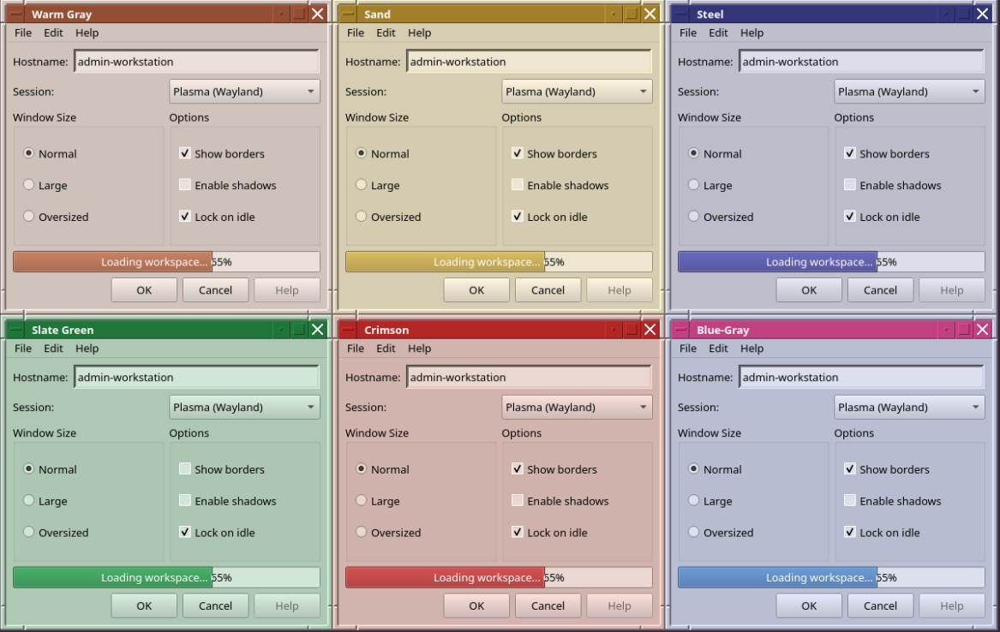
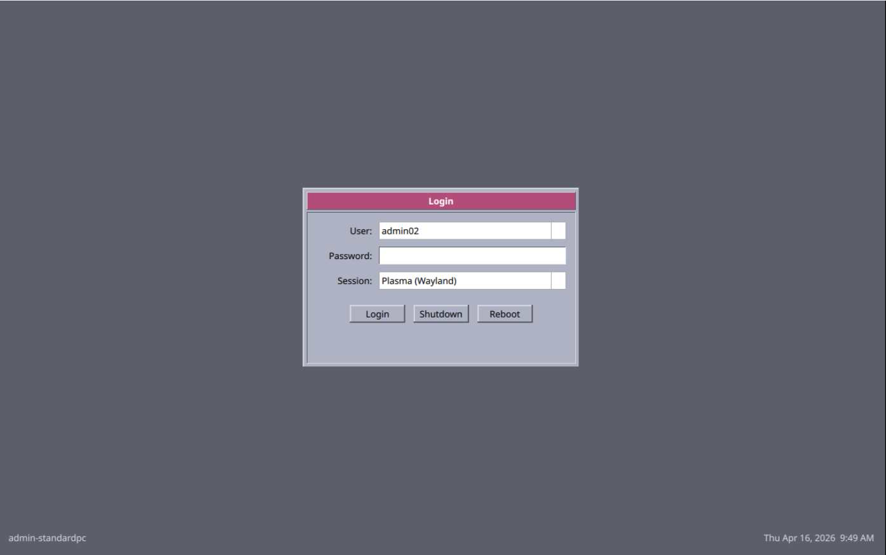

# CDE Plasma Theme

A complete Common Desktop Environment (CDE) theme for KDE Plasma 6, featuring the classic blue-gray color scheme with beveled 3D controls.

## Screenshots

### Color Palette Demo
Six color variations showing the CDE beveled window style with custom borders, title bars, and flat progress bars.



### Desktop
CDE-themed Plasma desktop with beveled window decorations, application menu, and taskbar.


### SDDM Login
CDE-styled login screen with beveled window frame, user/password fields, and session selector.



## Components

- **KWin Decoration** — Window frames with CDE-style beveled borders, L-shaped resize corners, and titlebar buttons
- **Qt Widget Style** — Buttons, scrollbars, menus, flat progress bars with CDE appearance
- **Plasma Theme** — Panel, system tray, and plasmoid styling
- **SDDM Login Theme** — CDE-styled login screen with window frame
- **Lock Screen** — CDE-styled lock screen matching the SDDM login
- **Color Scheme** — Blue-gray palette matching classic CDE
- **Cursor Theme** — Hackneyed retro cursor (auto-downloaded or from ~/Downloads)
- **Demo Script** — Six-window color palette showcase for screenshots

## Requirements

- KDE Plasma 6
- Qt 6, CMake, g++, pkg-config
- extra-cmake-modules, KF6 CoreAddons, KDecoration3, KCMUtils

Dependencies are installed automatically by the installer.

## Installation

```bash
./install.sh        # interactive
./install.sh -y     # auto-yes (no prompts, good for SSH)
```

The installer:
1. Detects your distro (Arch/Ubuntu/Fedora) and installs build dependencies
2. Builds and installs the KWin decoration plugin
3. Builds and installs the Qt widget style plugin
4. Installs the Plasma desktop theme
5. Installs the CDE color scheme
6. Installs the cursor theme (checks ~/Downloads for Hackneyed, then KDE Store)
7. Installs the SDDM login theme
8. Installs the look-and-feel theme (splash, logout)
9. Installs the CDE lock screen (system override with backup)
10. Configures KDE and SDDM to use the theme

All steps are logged to `logs/install-YYYYMMDD-HHMMSS.log`.

### Remote / Headless Install

```bash
scp -r cde-plasma user@host:~/cde-plasma
ssh user@host "cd ~/cde-plasma && bash install.sh -y"
```

## Uninstallation

```bash
./uninstall.sh
```

To restore the original lock screen:
```bash
sudo cp -r /usr/share/plasma/shells/org.kde.plasma.desktop/contents/lockscreen.breeze-backup/* \
           /usr/share/plasma/shells/org.kde.plasma.desktop/contents/lockscreen/
```

## Manual Activation

After installation, activate via System Settings:

- **Window Decorations**: Appearance > Window Decorations > CDE Frame
- **Application Style**: Appearance > Application Style > CDE
- **Plasma Style**: Appearance > Plasma Style > Commonality
- **Colors**: Appearance > Colors > CDE Blue-Gray
- **Cursors**: Appearance > Cursors > Hackneyed-48px

Log out and back in to see the SDDM login theme.

## Demo

Run the color palette demo to see all six CDE variations:

```bash
python3 demo/cde_demo.py
```

## License

MIT License
