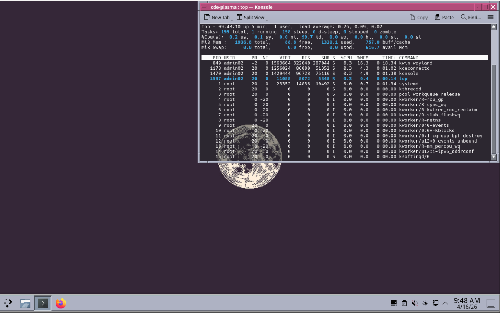
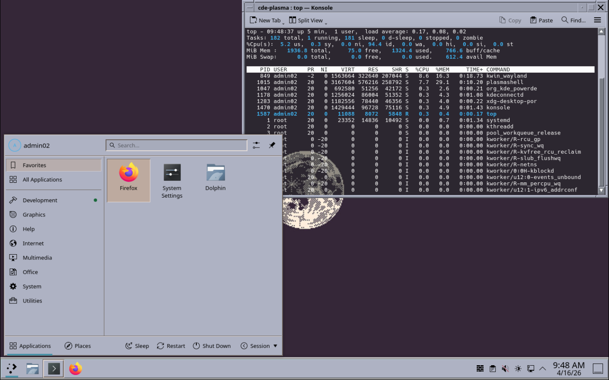

# CDE Plasma Theme

A Common Desktop Environment (CDE) theme set for KDE Plasma, with parallel support for Plasma 5 and Plasma 6.

It includes a custom KWin decoration, Qt widget style, Plasma theme, SDDM theme, lock screen styling, bundled color schemes, and helper scripts for applying or reverting the theme safely.

## Screenshots

### Color Palette Demo
Six color variations showing the CDE beveled window style with custom borders, title bars, and flat progress bars.


### Desktop
CDE-themed Plasma desktop with beveled window decorations, application menu, and taskbar.





### SDDM Login
CDE-styled login screen with beveled window frame, user/password fields, and session selector.


## Components

- **KWin Decoration**: CDE-style beveled borders, L-shaped resize corners, titlebar buttons, and preset frame color options
- **Qt Widget Style**: CDE buttons, scrollbars, menus, flat progress bars, and classic bevel rendering
- **Plasma Theme**: Panel, system tray, launcher, task manager, and plasmoid styling
- **Look-and-Feel Themes**: light and dark global themes
- **SDDM Theme**: CDE login screen
- **Lock Screen**: CDE lock screen integration for Plasma 5 and Plasma 6 layouts
- **Color Schemes**: `CDE Blue-Gray`, `CDE Dark`, `CDE Chartreuse`, and `CDE Electric Pink`
- **Helper Scripts**: apply, unapply, and light/dark mode switching
- **Demo Script**: screenshot/demo palette generator

## Version Support

- **Plasma 5**: KF5 / Qt5 code paths for the KWin decoration and Qt style
- **Plasma 6**: KF6 / Qt6 code paths for the KWin decoration and Qt style
- Shared assets such as Plasma theme, look-and-feel, SDDM theme, and most scripts are common across both

The source installer auto-detects whether the machine is running Plasma 5 or Plasma 6 and builds the matching compiled components.

## Requirements

- For release packages: use the package manager for your distro
- For source installs: `install.sh` installs the needed build dependencies for the detected Plasma version
- Plasma 5 builds use KF5 / Qt5 dependencies
- Plasma 6 builds use KF6 / Qt6 dependencies

## Installation

### From a Release Package

Grab the appropriate package from the [Releases page](https://github.com/spacestate1/cde-plasma/releases).

Current package targets:

| Target | Plasma Version | Package Type |
| --- | --- | --- |
| Arch / Manjaro / EndeavourOS | Plasma 6 | `.pkg.tar.zst` |
| Debian 13 / Ubuntu 24.10+ | Plasma 6 | `.deb` |
| Debian 12 / Ubuntu 22.04 / 24.04 | Plasma 5 | `.deb` |
| Fedora 40+ | Plasma 6 | `.rpm` |

Install the package, then apply the theme as your normal user:

```bash
cde-plasma-apply
```

To revert without uninstalling:

```bash
cde-plasma-unapply
```

### From Source

```bash
./install.sh
./install.sh -y
```

What `install.sh` does:

- detects Plasma 5 vs Plasma 6
- installs the matching build dependencies
- builds the matching KWin decoration and Qt widget style
- installs the shared Plasma / SDDM / look-and-feel assets
- installs all bundled color schemes
- applies the theme if you choose to do so

Logs are written to `logs/install-YYYYMMDD-HHMMSS.log`.

### Remote / Headless Install

```bash
scp -r cde-plasma user@host:~/cde-plasma
ssh user@host "cd ~/cde-plasma && bash install.sh -y"
```

## Applying and Switching

### Full Apply / Revert

```bash
cde-plasma-apply
cde-plasma-unapply
```

`cde-plasma-apply` snapshots the current user theme settings first so they can be restored later by `cde-plasma-unapply`.

### Safe Light / Dark Switching

```bash
cde-plasma-mode light
cde-plasma-mode dark
```

This helper directly updates the relevant KDE config keys and is the safest way to switch between the built-in light and dark variants after installation.

### Important Plasma 5 Note

On some Plasma 5.27 systems, the **Global Theme** GUI in System Settings does not reliably apply every category, especially colors and window decoration. If the GUI only partially applies the theme, use:

```bash
cde-plasma-mode light
# or
cde-plasma-mode dark
```

## Manual Activation

After installation, the main settings are:

- **Window Decorations**: `CDE Frame`
- **Application Style**: `CDE`
- **Plasma Style**: `Commonality` or `Commonality-Dark`
- **Colors**: `CDE Blue-Gray`, `CDE Dark`, `CDE Chartreuse`, or `CDE Electric Pink`
- **Cursors**: `Hackneyed-48px` when installed

Logging out and back in may be needed for SDDM or lock-screen changes to show up fully.

## Packaging and Local Builds

This repo contains local packaging/build scripts for the supported targets.

### Debian / Ubuntu

Plasma 6 build:

```bash
bash packaging/build-debian.sh 0.1.0
```

Plasma 5 build:

```bash
bash packaging/build-debian.sh 0.1.0 --plasma5
```

### Fedora RPM

Plasma 6 build:

```bash
bash packaging/build-fedora.sh 0.1.0
```

### Arch

Plasma 6 build:

```bash
bash packaging/build-arch.sh 0.1.0
```

Current packaging matrix:

- **Debian / Ubuntu**: Plasma 5 and Plasma 6
- **Fedora RPM**: Plasma 6
- **Arch**: Plasma 6

## Uninstallation

```bash
./uninstall.sh
```

This removes the user-local theme assets, color schemes, helper installs, and compiled plugin installs handled by the source-tree installer. If you installed a distro package, use the package manager to remove the packaged files.

## Demo

Run the color palette demo:

```bash
python3 demo/cde_demo.py
```

## Maintainer Note

The packaging scripts in `packaging/` are current, but this repo copy may not include any external CI workflow files. The local build scripts are the authoritative way to build packages from this tree.

## License

MIT License
